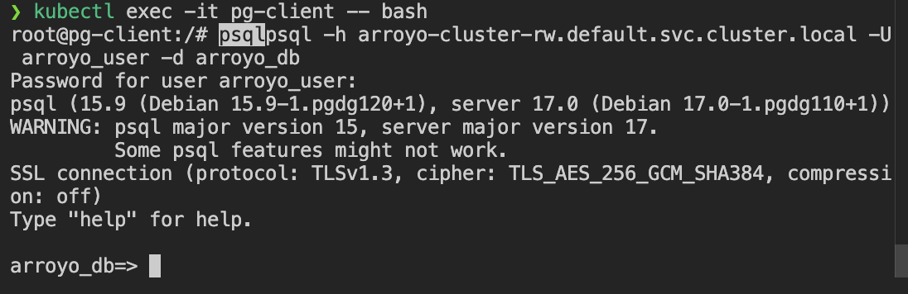

# arroyo + cnpg + minio setup

primarily following https://doc.arroyo.dev/deployment/kubernetes#example-local-configuration & https://doc.arroyo.dev/tutorial/kafka

```bash
helm repo add cnpg https://cloudnative-pg.github.io/charts
helm repo add arroyo https://arroyosystems.github.io/helm-repo

helm repo update
helm install cnpg cnpg/cloudnative-pg

helm search repo arroyo
helm seach repo cnpg
kubectl get pods -n cnpg-system
```

deploying psql cluster
```bash
$ kubectl apply -f postgresql-cluster.yaml
cluster.postgresql.cnpg.io/arroyo-cluster created
secret/arroyo-secret created

$ kubectl get pods
arroyo-cluster-1                       1/1     Running            0
arroyo-cluster-2                       1/1     Running            0             
arroyo-cluster-3                       1/1     Running            0    

$ kubectl get services
NAME                   TYPE        CLUSTER-IP       EXTERNAL-IP   PORT(S)                      AGE
arroyo-cluster-r       ClusterIP   10.109.164.194   <none>        5432/TCP                     9m54s
arroyo-cluster-ro      ClusterIP   10.106.236.43    <none>        5432/TCP                     9m54s
arroyo-cluster-rw      ClusterIP   10.100.251.97    <none>     
```

lets confirm we can access the arroyo_db
```bash
$ kubectl exec -it pg-client -- bash

$ psql -h arroyo-cluster-rw.default.svc.cluster.local -U arroyo_user -d arroyo_db
# here you should be prompted for the password, enter it
```


if you encounter password authentication issues like myself, alter the password using:
```bash
$ kubectl exec -it arroyo-cluster-1 -- psql -U postgres

$postgres=# ALTER USER arroyo_user WITH PASSWORD '<your intended password>';
```

## values.yaml file to configure checkpointUrl field (s3 or minIO necessary) 

- TODO - configure values.yaml with minio contents

### S3:
```yaml
   checkpointUrl: "s3://your-bucket/checkpoints" # Replace with your actual checkpoint URL

   # Optional: Configure external PostgreSQL if not deploying in-cluster
   postgresql:
     deploy: false
     externalDatabase:
       host: arroyo-cluster-rw.default.svc.cluster.local
       port: 5432
       name: arroyo_db
       user: arroyo_user
       password: arroyopassword

   # Optional: S3 or minIO
   s3:
     region: "us-west-2" # Replace with your actual region

   # Other configurations as needed
```

### MINIO:
```yaml
# values.yaml

checkpointUrl: "http://minio.default.svc.cluster.local:9000/checkpoints" # Replace with your MinIO service URL

# MinIO configuration
s3:
  region: "" # MinIO doesn't require a region, so this can be left empty
  accessKey: "minioadmin" # Replace with your MinIO access key
  secretKey: "minioadmin" # Replace with your MinIO secret key
  endpoint: "http://minio.default.svc.cluster.local:9000" # MinIO service URL
  bucket: "checkpoints" # The bucket name in MinIO

postgresql:
  deploy: false
  externalDatabase:
    host: arroyo-cluster-rw.default.svc.cluster.local
    port: 5432
    name: arroyo_db
    user: arroyo_user
    password: arroyopassword

# Other configurations as needed
```

### confirm it was configured
```bash
    helm install arroyo arroyo/arroyo -f values.yaml
    kubectl get pods
```
Note:
- Based on the default values provided by the helm show values command, it looks like you need to specify a checkpointUrl for the Arroyo Helm chart. This is likely a URL where Arroyo can store its checkpoints, which are essential for maintaining state in stream processing applications.

## Arroyo Deployment
```bash
# apply the arroyo.yaml file
$ kubectl apply -f arroyo.yaml
deployment.apps/arroyo created
# check pods
$ kubectl get pods

# verify it's running
$ kubectl logs <arroyo-pod-name>
```

TODO: verify we can deploy postgres & minio/s3
