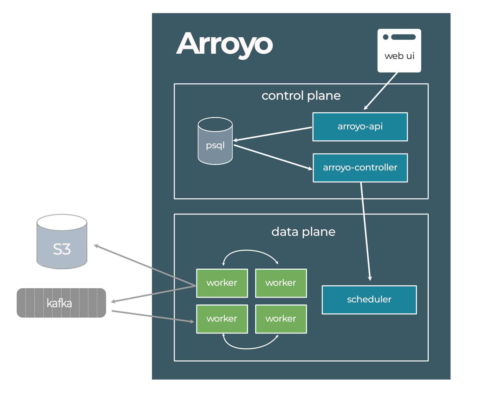

# Risingwave notes:

RisingWave supports using these systems or services as state backends.

- MinIO
- AWS S3
- S3-compatible object storages
- Google Cloud Storage
- Azure Blob Storage
- Alibaba Cloud OSS
- HDFS


MinIO example:
```yaml
spec:
  stateStore:
    # Prefix to objects in the object stores or directory in file system. Default to "hummock".
    dataDirectory: hummock

    # Declaration of the MinIO state store backend.
    minio:
      # Endpoint of the MinIO service.
      endpoint: risingwave-minio:9301

      # Name of the MinIO bucket.
      bucket: hummock001

      # Credentials to access the MinIO bucket.
      credentials:
        # Name of the Kubernetes secret that stores the credentials.
        secretName: minio-credentials

        # Key of the username ID in the secret.
        usernameKeyRef: username

        # Key of the password key in the secret.
        passwordKeyRef: password

```

### validate risingwave instance
```bash
kubectl get risingwave
# displays
NAME        RUNNING   STORAGE(META)   STORAGE(OBJECT)   AGE
risingwave  True      postgresql      S3                30s
```

# application flow

### 1. curl to imitate a like

```bash
curl -X POST http://your-api-server/like \
-H "Content-Type: application/json" \
-d '{
    "event_type": "like_notification_v1",
    "post_id": "1239213192",
    "poster_user_id": "231",
    "liker_user_id": "456",
    "timestamp": "2024-11-14T16:54:58+08:00"
}'
```

### 2. Server-side computing 
- Compute the liker_username on the server side
- Load updated payload to Kafka MQ

### 3. Kafka MQ buffer for incoming events


### 4. Risingwave Stream Processing
- Process events from MQ
- Transform/Filter/Map/Reduce the data

### 5. Persist in the PSQL database


Check to see if pods are running:

```bash
   kubectl -n cert-manager get pods
   kubectl -n risingwave-operator-system get pods
```


issues:
