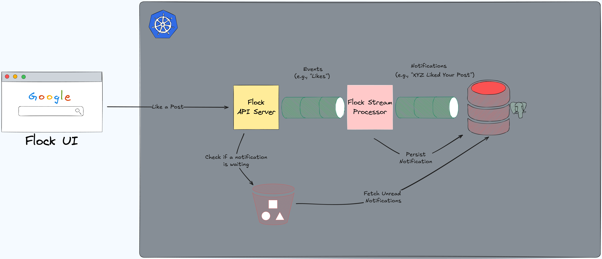

# flock notification system learning mvp



## Payload being passed when a user liked another post

`like_notification_v1`

```json
{
    "event_type": "like_notification_v1"
    "post_id": "1239213192",
    "poster_user_id": "231",
    "liker_user_id": "456",
    "liker_username": "tzdanows",
    "timestamp": "2024-11-14T16:54:58+08:00"
}
```

### Tech:

- Go
- Docker
- Kubernetes
- Kafka MQ
- Risingwave stream processing
- PostgreSQL (psql via cnpg)
- Kubectl
- Skaffold


### Resources:

- [Deploy RisingWave on Kubernetes(PRIMARY SETUP DIRECTIONS)](https://docs.risingwave.com/deploy/risingwave-kubernetes)
- [Arroyo Deployment on Kubernetes](https://doc.arroyo.dev/deployment/kubernetes)
- [RabbitMQ Kubernetes Operator Quickstart](https://www.rabbitmq.com/kubernetes/operator/quickstart-operator)
- [Cert Manager](https://cert-manager.io/docs/installation/)